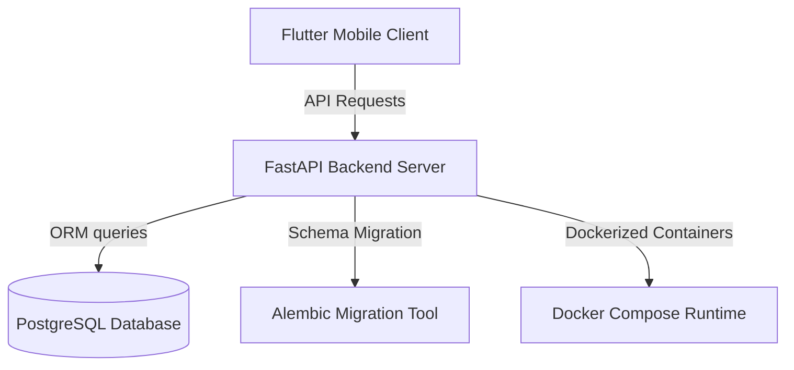

# Phsar Kasikor App (Farmer's Market) 🌾

Phsar Kasikor is a premium, modern B2B agricultural marketplace ecosystem designed to connect farmers (producers) and wholesale buyers (merchants). The platform facilitates direct negotiations, secure future crop contract farming agreements, order management, and realtime messaging.

---

## 🏗️ Project Architecture

The workspace is organized into two primary layers:



### 1. Backend (`/backend`)
* **Framework:** FastAPI (Python 3.10+)
* **Database & ORM:** PostgreSQL & SQLAlchemy ORM
* **Migrations:** Alembic database version control
* **Containerization:** Multi-stage Docker Compose setup (`backend`, `db`, `pgadmin`)

### 2. Frontend (`/frontend`)
* **Framework:** Flutter (Android & iOS mobile applications)

---

## 🌟 Core Business Features Implemented

### 1. Itemized Digital Farming Contracts
* **Multiple Crop Agreements:** A single contract supports a list of `ContractItem` lines.
* **Date Chronological Validations:** Enforces that contract start dates must be in the future (not today or past) and end dates must follow start dates.
* **Product Ownership Security:** Validates that all products included in a contract's items belong exclusively to the contract's designated `seller_id`.
* **Non-Destructive Cancellations:** Replaced contract delete actions with a cancel workflow (updating status to `TERMINATED` or `CANCELLED`) to preserve past contract audit history.
* **Editable Drafts:** Allows adding, updating, and removing contract items while the status remains `DRAFT`. Once accepted (`ACTIVE`), the agreement parameters are locked.

### 2. Automated Event Notifications
Realtime in-app alerts are automatically created inside the database on key events:
* **Order Events:** Instantly alerts the farmer when a new order is received, and notifies both parties if an order is cancelled.
* **Contract Events:** Notifies the receiver of new proposed agreements, and alerts actors when a contract becomes `ACTIVE`.
* **Chat Events:** Alerts the recipient when a new message is received.

### 3. Negotiation Chat System
* A direct messaging database model and API routes (`POST /chat/`, `GET /chat/{user_id}`) enabling buyers and sellers to negotiate terms prior to drafting formal contracts.

### 4. Order Management & Stock Control
* **Self-Purchasing Block:** Prevents users from ordering their own product listings.
* **Single-Seller Checkout:** Validates that an order checkout cart contains products from one seller only.
* **Realtime Stock Rollbacks:** Cancelling an order automatically rolls back reserved product inventory back into the available stock.

### 5. Media & Profile Support
* Added `image_url` to product catalogs and `profile_image_url` to user records.

---

## 🚀 Local Setup Instructions

### 1. Launch Services
Ensure you have Docker installed. In the `backend` directory, run:
```bash
docker compose up -d
```
This launches the FastAPI application, PostgreSQL database, and pgAdmin.

### 2. Run Database Migrations
To bring the PostgreSQL database schema up to date with the latest revisions (including chat tables, contract item changes, and new avatar fields):
```bash
docker compose exec backend alembic upgrade head
```

### 3. Explore API Documentation
Once running, you can explore, test, and authenticate API routes using the Swagger interactive interface:
* **Swagger UI:** [http://localhost:8000/docs](http://localhost:8000/docs)
* **ReDoc UI:** [http://localhost:8000/redoc](http://localhost:8000/redoc)

---

## 🛠️ Alembic Database Migration Commands

* **Create new migration:**
  ```bash
  docker compose exec backend alembic revision --autogenerate -m "description_of_changes"
  ```
* **Apply all updates:**
  ```bash
  docker compose exec backend alembic upgrade head
  ```
* **Rollback last migration:**
  ```bash
  docker compose exec backend alembic downgrade -1
  ```
